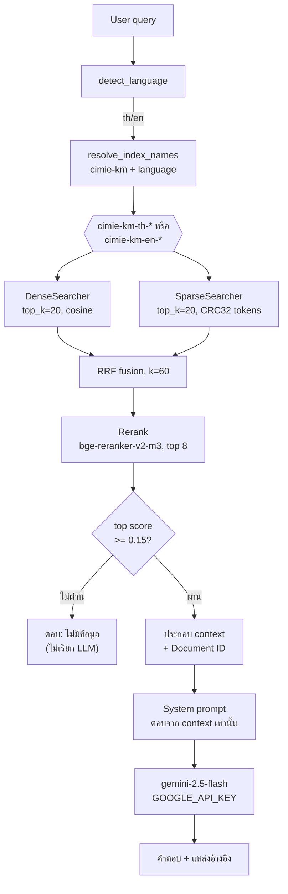

```mermaid
flowchart TD
    Q[User query] --> LD[detect_language]
    LD -->|th/en| RI[resolve_index_names<br/>cimie-km + language]
    RI --> IDX{{cimie-km-th-* หรือ<br/>cimie-km-en-*}}
    IDX --> DS[DenseSearcher<br/>top_k=20, cosine]
    IDX --> SS[SparseSearcher<br/>top_k=20, CRC32 tokens]
    DS --> RRF[RRF fusion, k=60]
    SS --> RRF
    RRF --> RR[Rerank<br/>bge-reranker-v2-m3, top 8]
    RR --> FLOOR{top score<br/>>= 0.15?}
    FLOOR -->|ไม่ผ่าน| REFUSE["ตอบ: ไม่มีข้อมูล<br/>(ไม่เรียก LLM)"]
    FLOOR -->|ผ่าน| CTX[ประกอบ context<br/>+ Document ID]
    CTX --> PROMPT[System prompt<br/>ตอบจาก context เท่านั้น]
    PROMPT --> LLM[gemini-2.5-flash<br/>GOOGLE_API_KEY]
    LLM --> ANS[คำตอบ + แหล่งอ้างอิง]
```